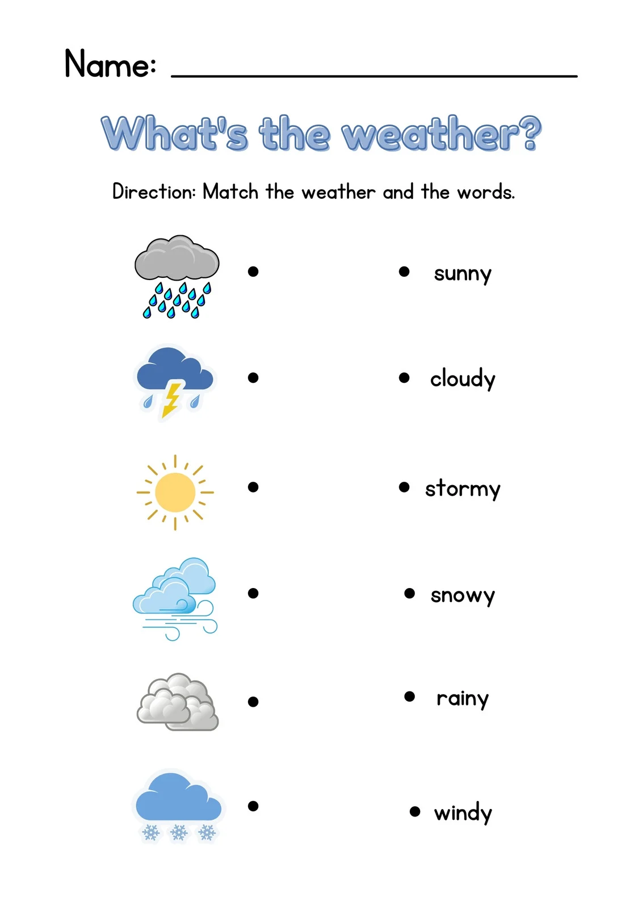

<p align="center">
  
</p>

# 🌍 Real-Time Weather Dashboard using AWS

This is a serverless weather dashboard using AWS Lambda, API Gateway, S3, and OpenWeatherMap API.

## 🧰 Tech Stack
- AWS Lambda
- API Gateway
- Amazon S3 (Static website hosting)
- IAM for roles and access
- OpenWeatherMap API (External weather data)
- JavaScript, HTML, CSS

## 🚀 Features
- Real-time weather updates based on city name
- Beautiful responsive UI with animations
- Fully serverless and scalable

## 🔧 How It Works
1. HTML is hosted on Amazon S3
2. API call made to API Gateway
3. API Gateway triggers Lambda
4. Lambda fetches weather from OpenWeather API
5. JSON is returned and displayed

## 🌐 Replace in index.html
Replace `your-api-id` in `fetch()` with your actual API Gateway ID.

## 🧪 Sample URL Format
```
https://your-api-id.execute-api.region.amazonaws.com/weather_dashboard/weather_dashboard?city=Hyderabad
```

## 📂 Folder Structure
```
weather-dashboard-project/
│
├── frontend/
│   └── index.html
├── lambda/
│   └── index.js
├── .env.example
└── README.md
```

---

💡 Built by Pujitha as part of APSSDC AWS Cloud Internship.
